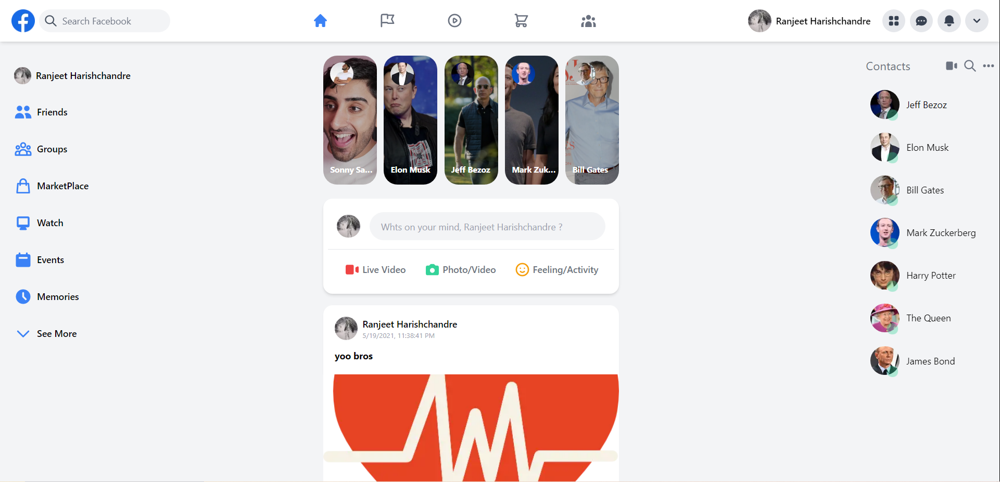

# Facebook NextJs Clone

This is the clone of Facebook, Build with React Framework called NextJs. Used tailwind css for styling.

## Table of contents

- [Overview](#overview)
  - [Screenshot](#screenshot)
- [My process](#my-process)
  - [Built with](#built-with)
- [Author](#author)
- [Acknowledgments](#acknowledgments)

## Overview

### Screenshot

## My process

### Built with

- Semantic HTML5 markup
- Tailwind CSS and SCSS custom properties
- Mobile-first workflow
- [React](https://reactjs.org/) - JS library
- [Next.js](https://nextjs.org/) - React framework

## Author

- Website - [Reanjeet Harishchandre (HR Developer) (https://modest-jones-78fd0c.netlify.app/)](https://www.your-site.com)

**Note: Delete this note and add/remove/edit lines above based on what links you'd like to share.**

## Acknowledgments

HR Developers
